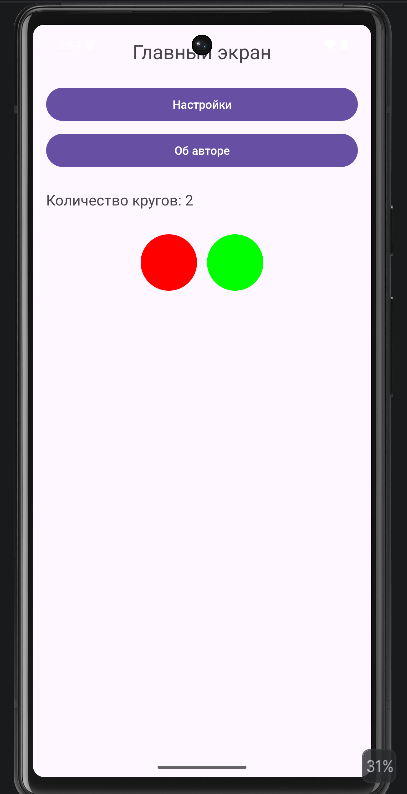
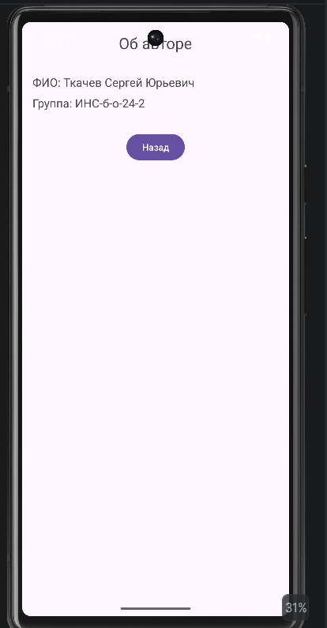

<div align="center">

# Отчёт

</div>

<div align="center">

## Практическая работа №5

</div>

<div align="center">

## Работа с несколькими окнами (Activity)

</div>

**Выполнил:**  
Ткачев Сергей Юрьевич  
**Курс:** 2  
**Группа:** ИНС-б-о-24-2  
**Направление:** ИПИНЖ (Институт перспективной инженерии)  
**Профиль:** Информационные системы и технологии  

---

### Цель работы

Научиться создавать многоэкранные приложения, осуществлять навигацию между активностями (`Activity`) и передавать данные между ними с использованием объектов `Intent` и механизма `startActivityForResult()` / `onActivityResult()`.

### Ход работы

#### Задание 1: Создание главной Activity

1. В Android Studio был создан новый проект с шаблоном **Empty Views Activity**. Проекту было дано имя `MultiWindowLab`.
2. В файле `activity_main.xml` был создан интерфейс с двумя кнопками: **«Настройки»** и **«Об авторе»**, а также областью, которая должна изменяться в зависимости от выбранных настроек.
3. На главном экране были размещены текстовый заголовок, две кнопки управления и контейнер для отображения кругов.

#### Листинг 1. Код `activity_main.xml`

```xml
<?xml version="1.0" encoding="utf-8"?>
<LinearLayout xmlns:android="http://schemas.android.com/apk/res/android"
    android:id="@+id/main"
    android:layout_width="match_parent"
    android:layout_height="match_parent"
    android:orientation="vertical"
    android:padding="16dp">

    <TextView
        android:id="@+id/tvMain"
        android:layout_width="wrap_content"
        android:layout_height="wrap_content"
        android:text="Главный экран"
        android:textSize="24sp"
        android:layout_gravity="center_horizontal"
        android:layout_marginBottom="24dp" />

    <Button
        android:id="@+id/btnSettings"
        android:layout_width="match_parent"
        android:layout_height="wrap_content"
        android:text="Настройки" />

    <Button
        android:id="@+id/btnAbout"
        android:layout_width="match_parent"
        android:layout_height="wrap_content"
        android:text="Об авторе"
        android:layout_marginTop="8dp" />

    <TextView
        android:id="@+id/tvResult"
        android:layout_width="wrap_content"
        android:layout_height="wrap_content"
        android:text="Количество кругов: 1"
        android:layout_marginTop="24dp"
        android:textSize="18sp" />

    <LinearLayout
        android:id="@+id/circleContainer"
        android:layout_width="match_parent"
        android:layout_height="wrap_content"
        android:orientation="horizontal"
        android:layout_marginTop="24dp"
        android:gravity="center" />

</LinearLayout>
```

---

#### Задание 2: Создание Activity «Настройки» (`SettingsActivity`)

1. Был создан XML-файл разметки `res/layout/activity_settings.xml`.
2. Был создан Java-класс `SettingsActivity`, унаследованный от `AppCompatActivity`, и в методе `onCreate()` для него была подключена разметка `activity_settings.xml`.
3. Activity была зарегистрирована в `AndroidManifest.xml`.
4. На экране настроек был реализован выбор количества отображаемых кругов на главной странице.

#### Листинг 2. Код `activity_settings.xml`

```xml
<?xml version="1.0" encoding="utf-8"?>
<LinearLayout xmlns:android="http://schemas.android.com/apk/res/android"
    android:layout_width="match_parent"
    android:layout_height="match_parent"
    android:orientation="vertical"
    android:padding="16dp">

    <TextView
        android:layout_width="wrap_content"
        android:layout_height="wrap_content"
        android:text="Настройки"
        android:textSize="24sp"
        android:layout_gravity="center_horizontal"
        android:layout_marginBottom="24dp" />

    <RadioGroup
        android:id="@+id/radioGroupCount"
        android:layout_width="wrap_content"
        android:layout_height="wrap_content"
        android:layout_marginBottom="16dp">

        <RadioButton
            android:id="@+id/radioOne"
            android:layout_width="wrap_content"
            android:layout_height="wrap_content"
            android:text="1 круг" />

        <RadioButton
            android:id="@+id/radioTwo"
            android:layout_width="wrap_content"
            android:layout_height="wrap_content"
            android:text="2 круга" />

        <RadioButton
            android:id="@+id/radioThree"
            android:layout_width="wrap_content"
            android:layout_height="wrap_content"
            android:text="3 круга" />
    </RadioGroup>

    <Button
        android:id="@+id/btnSave"
        android:layout_width="wrap_content"
        android:layout_height="wrap_content"
        android:text="Сохранить" />

</LinearLayout>
```

#### Листинг 3. Код `SettingsActivity.java`

```java
package com.ncfu.pw_5;

import android.content.Intent;
import android.os.Bundle;
import android.view.View;
import android.widget.Button;
import android.widget.RadioGroup;

import androidx.appcompat.app.AppCompatActivity;

public class SettingsActivity extends AppCompatActivity {

    private RadioGroup radioGroupCount;
    private Button btnSave;

    @Override
    protected void onCreate(Bundle savedInstanceState) {
        super.onCreate(savedInstanceState);
        setContentView(R.layout.activity_settings);

        radioGroupCount = findViewById(R.id.radioGroupCount);
        btnSave = findViewById(R.id.btnSave);

        btnSave.setOnClickListener(new View.OnClickListener() {
            @Override
            public void onClick(View v) {
                int selectedId = radioGroupCount.getCheckedRadioButtonId();
                int circleCount = 1;

                if (selectedId == R.id.radioTwo) {
                    circleCount = 2;
                } else if (selectedId == R.id.radioThree) {
                    circleCount = 3;
                }

                Intent resultIntent = new Intent();
                resultIntent.putExtra("CIRCLE_COUNT", circleCount);
                setResult(RESULT_OK, resultIntent);
                finish();
            }
        });
    }
}
```

---

#### Задание 3: Создание Activity «Об авторе» (`AboutActivity`)

1. Аналогично была создана `AboutActivity` с простой информацией об авторе.
2. В данной Activity не требуется возвращать результат, поэтому используется обычный `startActivity()`.

#### Листинг 4. Разметка `activity_about.xml`

```xml
<?xml version="1.0" encoding="utf-8"?>
<LinearLayout xmlns:android="http://schemas.android.com/apk/res/android"
    android:layout_width="match_parent"
    android:layout_height="match_parent"
    android:orientation="vertical"
    android:padding="16dp">

    <TextView
        android:layout_width="wrap_content"
        android:layout_height="wrap_content"
        android:text="Об авторе"
        android:textSize="24sp"
        android:layout_gravity="center_horizontal"
        android:layout_marginBottom="32dp" />

    <TextView
        android:layout_width="wrap_content"
        android:layout_height="wrap_content"
        android:text="ФИО: Ткачев Сергей Юрьевич"
        android:textSize="18sp" />

    <TextView
        android:layout_width="wrap_content"
        android:layout_height="wrap_content"
        android:text="Группа: ИНС-б-о-24-2"
        android:textSize="18sp"
        android:layout_marginTop="8dp" />

    <Button
        android:id="@+id/btnBack"
        android:layout_width="wrap_content"
        android:layout_height="wrap_content"
        android:text="Назад"
        android:layout_gravity="center_horizontal"
        android:layout_marginTop="32dp" />

</LinearLayout>
```

#### Листинг 5. Код `AboutActivity.java`

```java
package com.ncfu.pw_5;

import android.os.Bundle;
import android.view.View;
import android.widget.Button;

import androidx.appcompat.app.AppCompatActivity;

public class AboutActivity extends AppCompatActivity {
    @Override
    protected void onCreate(Bundle savedInstanceState) {
        super.onCreate(savedInstanceState);
        setContentView(R.layout.activity_about);

        Button btnBack = findViewById(R.id.btnBack);
        btnBack.setOnClickListener(new View.OnClickListener() {
            @Override
            public void onClick(View v) {
                finish();
            }
        });
    }
}
```

---

#### Задание 4: Реализация навигации в `MainActivity`

В файле `MainActivity.java` были добавлены обработчики для кнопок и реализовано получение результата из `SettingsActivity` с последующим изменением содержимого главного экрана.

#### Листинг 6. Код `MainActivity.java`

```java
package com.ncfu.pw_5;

import android.content.Intent;
import android.graphics.Color;
import android.graphics.drawable.GradientDrawable;
import android.os.Bundle;
import android.view.View;
import android.widget.Button;
import android.widget.LinearLayout;
import android.widget.TextView;

import androidx.annotation.Nullable;
import androidx.appcompat.app.AppCompatActivity;

public class MainActivity extends AppCompatActivity {

    private static final int REQUEST_CODE_SETTINGS = 1;
    private TextView tvResult;
    private LinearLayout circleContainer;

    @Override
    protected void onCreate(Bundle savedInstanceState) {
        super.onCreate(savedInstanceState);
        setContentView(R.layout.activity_main);

        Button btnSettings = findViewById(R.id.btnSettings);
        Button btnAbout = findViewById(R.id.btnAbout);
        tvResult = findViewById(R.id.tvResult);
        circleContainer = findViewById(R.id.circleContainer);

        drawCircles(1);

        btnSettings.setOnClickListener(new View.OnClickListener() {
            @Override
            public void onClick(View v) {
                Intent intent = new Intent(MainActivity.this, SettingsActivity.class);
                startActivityForResult(intent, REQUEST_CODE_SETTINGS);
            }
        });

        btnAbout.setOnClickListener(new View.OnClickListener() {
            @Override
            public void onClick(View v) {
                Intent intent = new Intent(MainActivity.this, AboutActivity.class);
                startActivity(intent);
            }
        });
    }

    @Override
    protected void onActivityResult(int requestCode, int resultCode, @Nullable Intent data) {
        super.onActivityResult(requestCode, resultCode, data);
        if (requestCode == REQUEST_CODE_SETTINGS) {
            if (resultCode == RESULT_OK && data != null) {
                int count = data.getIntExtra("CIRCLE_COUNT", 1);
                tvResult.setText("Количество кругов: " + count);
                drawCircles(count);
            }
        }
    }

    private void drawCircles(int count) {
        circleContainer.removeAllViews();

        for (int i = 0; i < count; i++) {
            View circle = new View(this);

            LinearLayout.LayoutParams params = new LinearLayout.LayoutParams(180, 180);
            params.setMargins(16, 16, 16, 16);
            circle.setLayoutParams(params);

            GradientDrawable shape = new GradientDrawable();
            shape.setShape(GradientDrawable.OVAL);

            if (i == 0) {
                shape.setColor(Color.RED);
            } else if (i == 1) {
                shape.setColor(Color.GREEN);
            } else {
                shape.setColor(Color.BLUE);
            }

            circle.setBackground(shape);
            circleContainer.addView(circle);
        }
    }
}
```

После запуска приложения при нажатии на кнопку **«Настройки»** открывается `SettingsActivity`, где можно выбрать количество кругов. После сохранения результата происходит возврат на `MainActivity`, и на главном экране отображается выбранное количество кругов. При нажатии на кнопку **«Об авторе»** открывается отдельная Activity с информацией об авторе.

<div align="center">


*Рисунок 1. Главная Activity*

</div>

<div align="center">


*Рисунок 2. Экран настроек*

</div>

<div align="center">


*Рисунок 3. Экран «Об авторе»*

</div>

<div align="center">


*Рисунок 4. Главный экран после изменения количества кругов*

</div>

---

#### Задания для самостоятельного выполнения

Необходимо было реализовать приложение с двумя дополнительными активностями: экран настроек и экран **«Об авторе»**. На главном экране должно отображаться применение настроек.

**Вариант 5:** Изменение количества отображаемых кругов на главной странице.

1. На главной активности был реализован контейнер для вывода кругов и текстовое поле, отображающее текущее количество фигур.
2. На экране настроек был добавлен выбор количества кругов с помощью `RadioGroup` и трёх `RadioButton`.
3. После выбора параметра и нажатия кнопки **«Сохранить»** выбранное значение передавалось обратно на главный экран через `Intent`.
4. На главной активности при получении результата происходило динамическое создание необходимого количества кругов с помощью `View` и `GradientDrawable`.
5. Также была реализована `AboutActivity`, содержащая сведения об авторе приложения.

<div align="center">


*Рисунок 5. Главная активность до изменения настройки*

</div>

<div align="center">


*Рисунок 6. Экран настроек*

</div>

<div align="center">



*Рисунок 7. Главная активность после изменения количества кругов*

</div>

<div align="center">



*Рисунок 8. Экран «Об авторе»*

</div>

### Вывод

В результате выполнения практической работы были получены навыки создания многоэкранных приложений, организации навигации между активностями (`Activity`) и передачи данных между ними с помощью объектов `Intent`. В ходе выполнения работы была освоена технология возврата результата из дочерней Activity в главную через механизм `startActivityForResult()` / `onActivityResult()`. В индивидуальной части работы был реализован экран настроек, позволяющий изменять количество отображаемых кругов на главной странице, а также экран **«Об авторе»**. Таким образом, цель практической работы была достигнута.

### Ответы на контрольные вопросы

1. **Что такое `Intent`? Какие существуют типы `Intent` (явные и неявные)? Приведите примеры использования каждого типа.**  

   `Intent` — это объект в Android, который описывает намерение выполнить какое-либо действие: открыть другую Activity, запустить сервис, отправить сообщение или передать данные.  

   **Явный `Intent`** используется, когда точно известно, какой компонент приложения нужно запустить. В этом случае указывается конкретный класс Activity.

   Пример явного `Intent`:

   ```java
   Intent intent = new Intent(MainActivity.this, SettingsActivity.class);
   startActivity(intent);
   ```

   **Неявный `Intent`** используется, когда указывается не конкретный класс, а действие, которое необходимо выполнить. Система Android сама находит подходящее приложение для выполнения этого действия.

   Пример неявного `Intent`:

   ```java
   Intent intent = new Intent(Intent.ACTION_VIEW);
   intent.setData(Uri.parse("https://google.com"));
   startActivity(intent);
   ```

2. **Как передать данные из одной Activity в другую с помощью `Intent`? Какие ограничения на типы передаваемых данных существуют?**  

   Для передачи данных из одной Activity в другую используются методы `putExtra()` и `getExtra()`. В первую Activity создаётся объект `Intent`, в него помещаются данные, после чего запускается другая Activity.

   Пример передачи:

   ```java
   Intent intent = new Intent(MainActivity.this, SettingsActivity.class);
   intent.putExtra("KEY_NAME", "Сергей");
   intent.putExtra("KEY_AGE", 20);
   startActivity(intent);
   ```

   Получение данных в другой Activity:

   ```java
   String name = getIntent().getStringExtra("KEY_NAME");
   int age = getIntent().getIntExtra("KEY_AGE", 0);
   ```

   Через `Intent` можно передавать примитивные типы данных, строки, массивы, а также объекты, реализующие интерфейсы `Serializable` или `Parcelable`.

3. **В чём разница между методами `startActivity()` и `startActivityForResult()`? В каких случаях используется каждый из них?**  

   Метод `startActivity()` используется для запуска новой Activity без ожидания какого-либо результата от неё. Он подходит, когда нужно просто открыть другой экран.

   Метод `startActivityForResult()` используется в случае, если после закрытия второй Activity необходимо вернуть данные обратно в первую Activity.

   Например:
   - `startActivity()` удобно использовать для открытия экрана **«Об авторе»**;
   - `startActivityForResult()` используется для экрана **«Настройки»**, так как после его закрытия нужно вернуть выбранное значение.

4. **Опишите назначение методов `setResult()` и `finish()` в контексте возврата данных из дочерней Activity.**  

   Метод `setResult()` используется в дочерней Activity для установки результата, который будет передан обратно в родительскую Activity. В него обычно передают код результата (`RESULT_OK` или `RESULT_CANCELED`) и объект `Intent` с данными.

   Метод `finish()` завершает текущую Activity и возвращает пользователя на предыдущий экран. Если перед этим был вызван `setResult()`, то данные будут переданы обратно.

   Пример:

   ```java
   Intent resultIntent = new Intent();
   resultIntent.putExtra("CIRCLE_COUNT", 3);
   setResult(RESULT_OK, resultIntent);
   finish();
   ```

5. **Что произойдёт, если не зарегистрировать Activity в файле `AndroidManifest.xml`?**  

   Если Activity не зарегистрировать в `AndroidManifest.xml`, приложение не сможет её открыть. При попытке запуска такой Activity возникнет ошибка, и приложение завершится аварийно. Обычно это сопровождается исключением `ActivityNotFoundException`.

6. **Какие методы жизненного цикла Activity вызываются при переходе от `MainActivity` к `SettingsActivity` и при возврате обратно?**  

   При переходе от `MainActivity` к `SettingsActivity` обычно вызываются:
   - у `MainActivity`: `onPause()`, затем `onStop()`;
   - у `SettingsActivity`: `onCreate()`, `onStart()`, `onResume()`.

   При возврате обратно:
   - у `SettingsActivity`: `onPause()`, `onStop()`, `onDestroy()`;
   - у `MainActivity`: `onRestart()`, `onStart()`, `onResume()`.

7. **Для чего используется `requestCode` в методе `startActivityForResult()`? Как обрабатываются несколько различных запросов в `onActivityResult()`?**  

   `requestCode` — это числовой код, который позволяет определить, из какой именно Activity был возвращён результат. Это особенно полезно, если из одной Activity открывается несколько разных экранов с ожиданием результата.

   Пример:

   ```java
   static final int REQUEST_SETTINGS = 1;
   static final int REQUEST_PICKER = 2;
   ```

   При запуске:

   ```java
   startActivityForResult(intent1, REQUEST_SETTINGS);
   startActivityForResult(intent2, REQUEST_PICKER);
   ```

   В методе `onActivityResult()` можно проверить `requestCode` и выполнить нужную обработку:

   ```java
   @Override
   protected void onActivityResult(int requestCode, int resultCode, @Nullable Intent data) {
       super.onActivityResult(requestCode, resultCode, data);

       if (requestCode == REQUEST_SETTINGS) {
           // обработка результата настроек
       } else if (requestCode == REQUEST_PICKER) {
           // обработка другого результата
       }
   }
   ```
